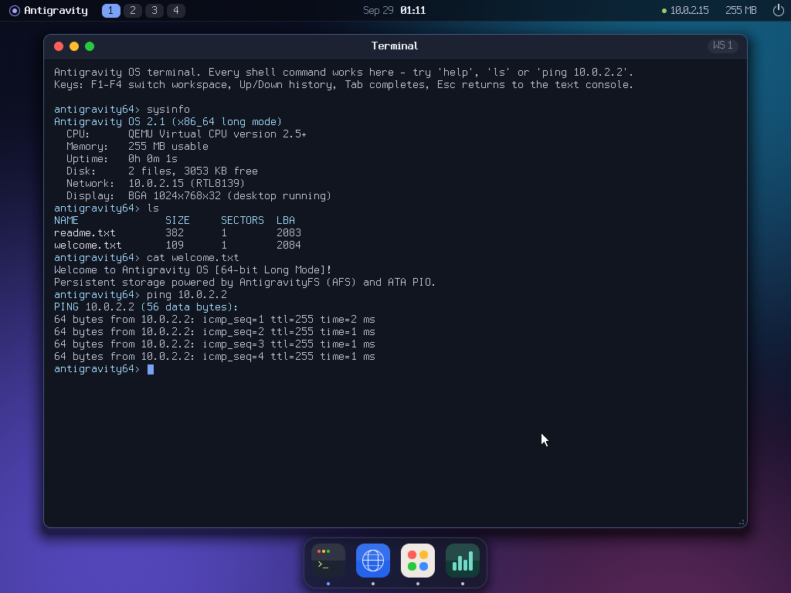
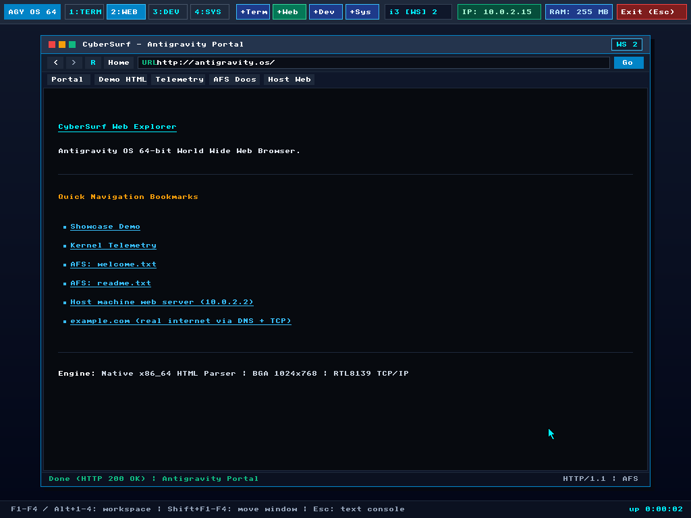
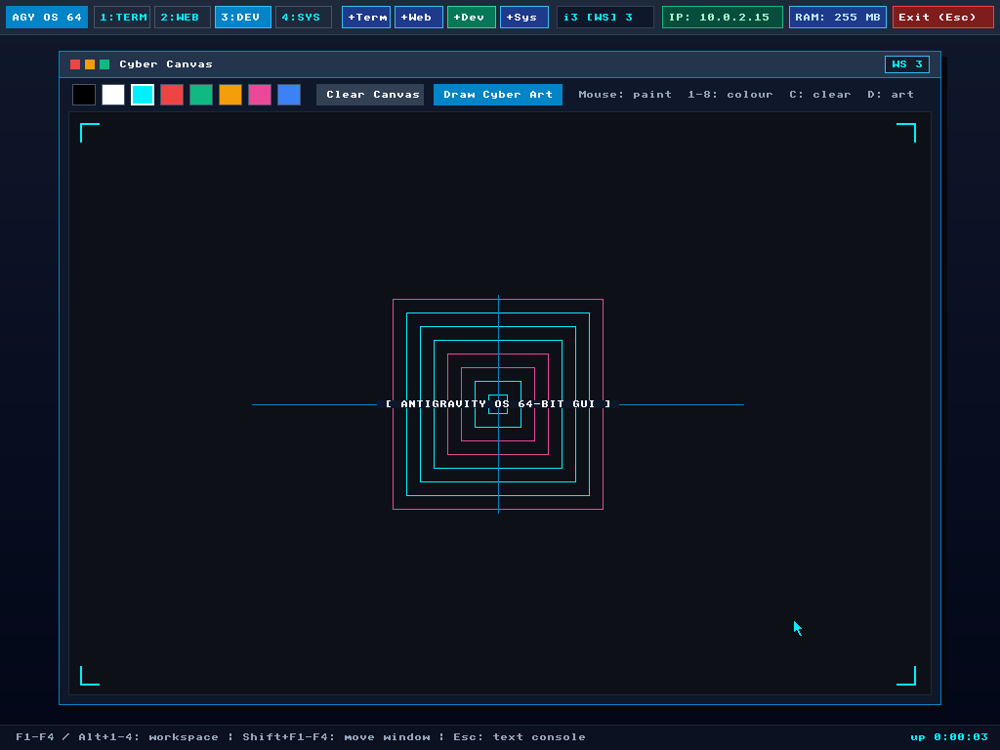
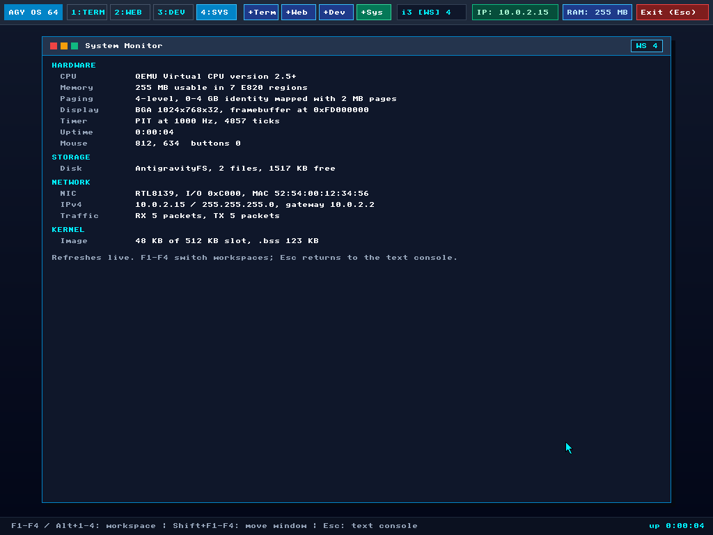
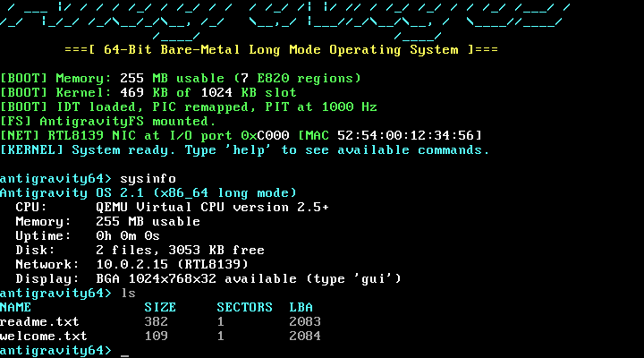

# Antigravity OS

A 64-bit operating system written entirely in x86_64 NASM assembly, with no C
and no external libraries. It boots from its own MBR into long mode and brings
up a filesystem, a TCP/IP stack with a web browser and web server, and a
windowed desktop with i3-style workspaces.



| | |
|---|---|
|  |  |
|  |  |

## Features

- **Boot:** a two-stage loader. The MBR loads stage 2, which loads the kernel
  (up to 512 KB), reads the BIOS E820 memory map, identity-maps 0–4 GB with
  2 MB pages and enters long mode.
- **Kernel:**
  - IDT with a real handler for every CPU exception; each one prints a full
    register dump.
  - 8259 PIC and a 1 kHz PIT timer.
  - x87 FPU and SSE enabled (JavaScript numbers are doubles).
  - Serial console on COM1: output is mirrored there and serial input drives
    the shell.
- **Storage:** ATA PIO driver and AntigravityFS (AFS1), with files that
  persist on disk.
- **Network:** RTL8139 driver plus Ethernet, ARP, IPv4, ICMP (`ping`), UDP,
  DNS, TCP, an HTTP/HTTPS client (`curl`) and an HTTP server (`tcplisten`).
- **TLS 1.3:** `https://` in `curl` and the browser, all in assembly:
  X25519, ChaCha20-Poly1305, SHA-2, and certificate verification with RSA
  (PKCS#1 v1.5 and PSS, up to 4096 bits) and ECDSA (P-256, P-384) against the
  Mozilla root store, the CMOS clock and the host name.
- **Shell:** about 30 commands, Tab completion, history (Up/Down) and Ctrl+C.
- **JavaScript:** an engine written in assembly (`kernel/js/`): a parser,
  a bytecode compiler, an interpreter and a garbage collector, with
  classes, closures, exceptions, destructuring, generators, promises,
  `async`/`await`, timers, `fetch`, regular expressions, `Map`/`Set`,
  `Symbol`, `Date`, the everyday standard library and correctly rounded
  number formatting. Run it with `js`; web pages run it too.
- **Desktop:**
  - 1024×768×32 graphics through the Bochs/QEMU display adapter.
  - Movable and resizable windows with minimize and maximize, and 4
    workspaces.
  - Apps:
    - a terminal that runs the same shell as the text console
    - the CyberSurf web browser: built-in pages, `afs://` files, real HTTP
      and HTTPS with redirects; an HTML parser, a CSS engine (style sheets,
      selectors, the cascade, `@media`), a layout engine drawing with the
      8x8 font, and page scripts with the DOM and click events; scrolling
      and relative links
    - a paint canvas
    - a live system monitor

## Quick start

You need **NASM**, **QEMU** and **Python 3.8+**. The build is plain Python
with no extra packages, so it behaves the same everywhere.

| Platform | Install |
|---|---|
| Windows | `winget install NASM.NASM SoftwareFreedomConservancy.QEMU Python.Python.3.12` |
| Ubuntu / WSL | `sudo apt install nasm qemu-system-x86 python3` |
| macOS | `brew install nasm qemu python` |

```sh
python tools/build.py run            # build and boot in a QEMU window
python tools/build.py run --headless # no window: the serial console is your terminal (Ctrl+A X quits)
python tools/build.py test           # run the automated test suite (~40 s)
```

On Windows, `.\build.ps1 -Run` does the same thing; on Linux and macOS,
`make run` does. Both are thin wrappers around `tools/build.py`.

### `tools/build.py`

| Command | What it does |
|---|---|
| *(none)* | Assemble everything into `build/os.img`, keeping the files on the disk |
| `--fresh` | Rebuild and reformat the disk from `rootfs/` |
| `run [--headless] [--fresh] [--kvm] [-m 512M]` | Build and boot in QEMU. The serial console appears in your terminal |
| `test [-k NAME]` | Run the QEMU test suite, or only the tests whose name contains `NAME` |
| `size` | Kernel image and `.bss` usage against their limits |
| `sym 0x17C6D` | Name the kernel function containing an address, e.g. a panic RIP |
| `debug` | Boot paused, waiting for `gdb` on `localhost:1234` |
| `clean` | Delete `build/` |

The disk image is `build/os.img`. `python tools/mkimage.py ls build/os.img`
and `... cat build/os.img welcome.txt` read its files from the host.

## Using it

**Text console.** Type `help` for the full command list:

```
ls  cat  touch  write  rm  df                     files
ifconfig  arp  ping  dns  curl  tcplisten         network
sysinfo  about  cpu  mem  regs  uptime  clear     system
js <code | file.js>                               JavaScript
gui  browser [url]  ws  exit                      desktop
```

**Desktop.** Type `gui`, or `browser [url]` to open the desktop straight
into the browser.

| Keys / mouse | Action |
|---|---|
| F1–F4, Alt+1–4 | Switch workspace |
| Shift+F1–F4 | Move the focused window to that workspace |
| Title bar dots | Close / minimize / maximize |
| Drag title bar or bottom-right corner | Move / resize |
| `WS n` badge in the title bar | Send the window to the next workspace |
| Taskbar `+Term` `+Web` `+Dev` `+Sys` | Open, focus or minimize an app |
| Esc or `Exit` | Back to the text console |

The terminal window runs the real shell, so every command works there too.
`ws [n]` and `ws move n` control workspaces from inside it.

**Web.** `curl example.com/` or `curl https://www.google.com/`, or type a
URL into the browser. `tcplisten` serves a page that your host can open at
<http://localhost:8888>.

A page goes through the same stages as in a big browser, all in
`kernel/web/`, and then its scripts run (`kernel/js/`, see JavaScript
below):

1. `dom.asm` parses the HTML into a DOM tree, with the HTML rules that
   matter for display (void elements, `<p>`/`<li>`/`<td>` closing each other,
   raw `<script>`/`<style>` text, a missing `</head>`).
2. `css.asm` reads style sheets: the browser's defaults (`web/ua.css`), the
   dark look of its own pages (`web/builtin.css`), the page's `<style>`
   blocks and `<link rel=stylesheet>` files (fetched over HTTP/HTTPS), and
   `style=""`. Selectors: type, `.class`, `#id`, `*`, descendant and child
   combinators, `:root`, `:first-child`, `:last-child`, `:not(.class)`,
   `:not(:hover)`-style states; `@media` (width, screen/print,
   color scheme), `@supports`, `@layer`. The cascade does specificity,
   source order, `!important` and inheritance. Properties: `display`,
   `visibility`, `color`, `background(-color)`, `font-weight`,
   `text-decoration`, `text-align`, `white-space`, `list-style`,
   `text-transform`, margins and padding, plus the tricks sites use to
   hide things (`position:absolute` with 1px size or `clip`, `height:0` with
   `overflow:hidden`, `opacity:0`, far-off `left`/`top`). Old HTML
   attributes (`bgcolor`, `<font color>`, `align`) count too.
3. `layout.asm` lays the styled tree out into a display list: block boxes
   with collapsing margins, line boxes wrapped at words and aligned,
   lists with bullets or numbers, table rows with cells side by side,
   background colours. It is redone only when the page or the window width
   changes; scrolling just repaints.

Everything is drawn with the 8x8 font, so there are no font sizes, and CSS
lengths are halved to match it. Not supported: `var()`, attribute
selectors, `+`/`~`, pseudo-elements, floats, flexbox and grid as layouts
(they become plain blocks), positioning, images. Scroll with Up/Down,
PgUp/PgDn, Home/End or the mouse wheel. Pages up to 1 MB are kept.

| Keys / mouse (browser) | Action |
|---|---|
| Type, Enter | Edit the address, go |
| Up / Down, mouse wheel | Scroll a few lines |
| PgUp / PgDn, Home / End | Scroll a screen, to the top / bottom |
| Click a link | Follow it (relative links resolve against the page) |
| Click anything else | The page's `click` handlers run |

HTTPS speaks TLS 1.3 with one cipher suite, `TLS_CHACHA20_POLY1305_SHA256`,
and one key exchange, X25519. Servers that only offer AES-GCM (rare, since
TLS 1.3 servers normally support ChaCha20) fail with a handshake alert.

The server must prove who it is: its certificate chain has to lead to a
trusted root, every certificate has to be within its validity period (`date`
shows the clock it is checked against), intermediates have to be CAs, the
server certificate has to name the host (subjectAltName, `*.` wildcards,
IP addresses), and its CertificateVerify signature has to check out. If not,
the browser shows *Secure Connection Failed* with the reason and `curl`
prints it; `curl -k` skips the checks and says so. Not checked: revocation
(OCSP/CRL), name constraints and path length limits.

Trusted roots:

- the Mozilla set, compiled into the kernel from `kernel/data/roots.der`
  (regenerate with `python tools/mkroots.py`, which reads the host's
  `/etc/ssl/certs/ca-certificates.crt`; `kernel/data/roots.txt` lists them)
- your own: DER certificates back to back in the AFS file `localca.der`,
  e.g. `python tools/mkimage.py add build/os.img myca.der --name localca.der`

`cryptotest` runs the crypto on the RFC test vectors and fixed RSA and ECDSA
signatures (`tools/gen_cryptotest.py`).

**JavaScript.** `js` runs a line of code, or a script file from the disk,
and prints the result the way Node.js does:

```
antigravity64> js 0.1 + 0.2
0.30000000000000004
antigravity64> js function fib(n) { return n < 2 ? n : fib(n-1) + fib(n-2) } fib(20)
6765
antigravity64> js console.log('sum', [1, 2, 3], {a: 'x'})
sum [ 1, 2, 3 ] { a: 'x' }
antigravity64> js nope()
Uncaught ReferenceError: nope is not defined (line 1)
antigravity64> js script.js
```

Each run starts from a fresh engine. Like Node.js, `js` then runs the
promise jobs the script queued and waits for its timers until none are
left, so `js setTimeout(() => console.log('later'), 500)` prints `later`
half a second on. Esc or Ctrl+C stops a script that doesn't end, or the
waiting.

In the browser, every HTML page gets its own engine with `window` and
`document`. Its `<script>`s run in order (inline or `src=`, which is
fetched), then `DOMContentLoaded` and `load` fire. `console.log` output
and errors go to the serial log as `[klog] js: ...`; an error ends only
the script it happened in. Clicks run the page's handlers (`onclick=""`,
`onclick` properties and `addEventListener`), which bubble up the tree;
`preventDefault()` stops a link from being followed. The page's timers,
animation frames and `fetch` / `XMLHttpRequest` requests run from the
desktop loop while it is open. After scripts change the DOM, the page is
styled and laid out again. The DOM API (`kernel/js/jsdom.asm`):

- `document`: `getElementById`, `querySelector(All)` (the CSS engine's
  selectors), `getElementsByTagName` / `ClassName`, `createElement`,
  `createTextNode`, `write` / `writeln`, `body`, `head`,
  `documentElement`, `title`, `readyState`, `URL`
- elements: `textContent`, `innerHTML`, `outerHTML`, `id`, `className`,
  `classList`, `style` (with `cssText`), `get/set/remove/hasAttribute`,
  reflected attributes (`href`, `src`, `value`, `checked`, `hidden`, ...),
  `appendChild`, `insertBefore`, `replaceChild`, `removeChild`, `remove`,
  `append`, `cloneNode`, `contains`, `matches`, `closest`, `click()`, and
  the tree (`parentNode`, `children`, `childNodes`, `firstChild`,
  `nextElementSibling`, ...)
- events: `addEventListener` / `removeEventListener`, `event.target`,
  `currentTarget`, `preventDefault()`, `stopPropagation()`
- `window`: `alert` (status bar and log), `location` (`href`, `pathname`,
  ...; setting `href` loads the page), `navigator.userAgent`,
  `innerWidth` / `innerHeight`

Lists from `querySelectorAll` and friends are plain arrays, not live
collections. The engine (`kernel/js/`) works like the big ones, minus the
optimising compilers:

1. `lexer.asm` turns the text into tokens; names and strings become atoms
   (one shared copy per text, so property names compare as pointers).
2. `parser.asm` builds a syntax tree and records every declaration in its
   scope.
3. `compiler.asm` turns the tree into bytecode. Variables of functions that
   contain no other functions live in stack slots; the others live in heap
   environments that closures capture (`let` in a `for` loop gets a fresh
   one each time round).
4. `vm.asm` runs the bytecode on a value stack. Calls between JavaScript
   functions don't use the kernel stack, so deep recursion ends with
   `RangeError: Maximum call stack size exceeded` instead of a crash.
5. Values are NaN-boxed doubles; `number.asm` converts between text and
   doubles with exact big-integer arithmetic where needed, so numbers print
   exactly as in a browser (`1e+21`, `5e-324`, `(1.005).toFixed(2)` is
   `1.00`).
6. `gc.asm` collects garbage: a mark-sweep collector that never moves
   anything. It marks conservatively (any word on the stacks, in the
   kernel's variables, in DOM nodes or inside a live block that points at a
   heap block keeps it), so the rest of the engine needs no bookkeeping.
   Freed blocks are joined and reused; each collection logs
   `[klog] js gc: live bytes ...`.
7. `async.asm` has promises, the microtask queue, timers and the event
   loop. An `await` copies the function's part of the value stack, its
   `try` handlers and its registers into a heap object and returns the
   function's promise; a promise job copies it all back and carries on
   after the `await`. `jsnet.asm` has `fetch` and `XMLHttpRequest`, whose
   requests run as tasks on the event loop (GET only, for now).
8. `iter.asm` has symbols (a value tag of their own; a symbol works as a
   property key), the iteration protocol that `for-of`, spread and
   destructuring use, and generators (on the same coroutines as `await`).
   `collections.asm` has `Map` and `Set` (insertion-ordered entries and a
   hash table). `regexp.asm` compiles regular expressions into a small
   program and matches with backtracking on its own stack; `regexp2.asm`
   has `RegExp` and the string methods that take one. `date.asm` has
   `Date`.

The language: `var`/`let`/`const`, functions, arrow functions, closures,
default and rest parameters, `arguments`, `this`, `new`, prototypes,
`class` (fields, `static`, getters and setters, `extends`, `super`, also
`extends Error`), object literals with methods, getters, setters, computed
keys and spread, destructuring (declarations, parameters, `for-of`,
`catch`, assignments), spread in arrays and calls, template literals,
optional chaining, every operator including `**`, `??` and the logical
assignments, `if`/`for`/`for-in`/`for-of`/`while`/`do`/`switch`, labels,
and `try`/`catch`/`finally` with `Error`, `TypeError`, `RangeError`,
`SyntaxError` and `ReferenceError`.

The library: `console.log`, `Math` (all functions), `JSON.stringify` (with
a replacer function, indent and `toJSON`) and `JSON.parse`, `parseInt`,
`parseFloat`, `isNaN`, `isFinite`, `String`, `Number` (`isInteger`,
`isSafeInteger`, ...), `Boolean`; `Object.keys`/`values`/`entries`/
`assign`/`create`/`getPrototypeOf`/`setPrototypeOf`/`defineProperty`/
`defineProperties`/`getOwnPropertyNames`/`getOwnPropertyDescriptor`/
`fromEntries`/`freeze`/`is`; `call`/`apply`/`bind`; arrays: `push`,
`pop`, `shift`, `unshift`, `splice`, `slice`, `concat`, `join`,
`reverse`, `sort` (stable), `indexOf`, `lastIndexOf`, `includes`, `find`,
`findIndex`, `findLast`, `findLastIndex`, `forEach`, `map`, `filter`,
`reduce`, `reduceRight`, `some`, `every`, `fill`, `flat`, `flatMap`,
`at`, `Array.from`, `Array.of`, `Array.isArray`; strings: `split`,
`replace`/`replaceAll` (string patterns, `$&` and friends, or a
function), `includes`, `startsWith`, `endsWith`, `indexOf`,
`lastIndexOf`, `slice`, `substring`, `padStart`, `padEnd`, `repeat`,
`trim`/`trimStart`/`trimEnd`, `at`, `charAt`, `charCodeAt`, `concat`,
`toUpperCase`, `toLowerCase`, `localeCompare`; `toFixed` and
`toString(radix)`.

Async: `Promise` (`then`, `catch`, `finally`, `resolve`, `reject`, `all`,
`allSettled`, `race`, `any`; "Uncaught (in promise)" for rejections nobody
handles), `async` functions, arrows and methods with `await`,
`queueMicrotask`, `setTimeout` / `setInterval` (and their `clear`s),
`requestAnimationFrame`, `performance.now()`, `fetch` (a `Response` with
`status`, `ok`, `headers.get()`, `text()`, `json()`) and
`XMLHttpRequest` (asynchronous or not, `onload` and friends,
`addEventListener`, `responseType = 'json'`).

And: `Symbol` (with `Symbol.for`, `description` and the well-known
symbols), iterators (`[Symbol.iterator]`, `entries()` / `keys()` /
`values()`), generators (`function*`, generator methods, `yield`,
`yield*`, `next` / `return` / `throw`), `Map`, `Set`, `WeakMap`,
`WeakSet`, regular expressions (literals and `RegExp`: classes, groups,
named groups, backreferences, lookahead and lookbehind, lazy and counted
quantifiers, the `g i m s u y` flags; `exec`, `test`, `match`,
`matchAll`, `search`, `replace` / `replaceAll` with `$1` / `$<name>` or a
function, `split`) and `Date` (parsing ISO and the usual English forms;
the local time zone is UTC).

Not yet: tagged templates, private `#fields`, `with`, modules, async
generators; in the browser, `localStorage`, many DOM methods and typing
into form fields. Strings are UTF-8 bytes, so `length` counts bytes.

## Project layout

```
boot/
  stage1.asm            MBR: loads stage 2 (has BPB space + partition table for real hardware)
  stage2.asm            loads the kernel, E820, A20, page tables, long mode
include/
  layout.inc            disk layout (sector numbers)   - shared by boot, kernel, tools
  memmap.inc            physical memory map            - shared by boot, kernel, tools
kernel/
  kernel.asm            entry point, section layout, include list, main loop
  core/                 gdt, idt (+ exception stubs), panic, timer (PIT), memory (E820)
  lib/                  string and buffer-formatting helpers
  drivers/              serial, vga_text, keyboard, mouse, pci, ata, rtl8139, bga
  console/console.asm   output routing (VGA / GUI terminal / serial) and the key queue
  fs/afs.asm            AntigravityFS
  net/                  eth (ARP), ipv4 (ICMP), udp (DNS), tcp (HTTP), url,
                        tls (TLS 1.3 client), x509 (certificates and chains)
  crypto/               sha256 + HMAC, sha512/384, chacha20poly1305, x25519,
                        bignum (Montgomery), rsa, ecc (ECDSA P-256/P-384), random
  data/roots.der        trusted root certificates (tools/mkroots.py)
  web/                  dom (HTML parser), css (style sheets, cascade), layout (display list),
                        ua.css / builtin.css (the browser's own style sheets)
  js/                   JavaScript engine: lexer, parser, compiler (bytecode), vm,
                        heap (strings, atoms), gc (allocator, collector), object, number,
                        builtins + stdlib (the standard library), async (promises,
                        async functions, timers, event loop), jsnet (fetch, XHR),
                        iter (symbols, iterators, generators), collections (Map, Set),
                        regexp + regexp2 (regular expressions), date (Date),
                        jsdom (the DOM API), js (API, printing)
  gfx/                  clipped 2D drawing, font, back buffer, mouse pointer
  gui/                  window manager + event loop, taskbar/footer, theme colours
  apps/                 terminal, browser, canvas, sysmon windows
  apps/shell/           line editor + command table + command handlers
rootfs/                 files copied onto a freshly formatted disk
tools/                  build.py, mkimage.py (disk images), ppm.py (screenshots)
tests/                  harness.py + test_*.py (QEMU-driven, stdlib unittest)
docs/                   CONVENTIONS.md, screenshots
```

## How it works

### Boot

1. **BIOS → stage 1** (`0x7C00`). Checks for INT 13h LBA extensions and loads
   stage 2 to `0x7E00`.
2. **Stage 2.**
   - Prints its progress to COM1.
   - Loads the kernel to `0x10000` in 32 KB chunks. `mkimage.py` patches the
     kernel's sector count into the stage 2 header.
   - Enables A20, stores the E820 map at `0x600`, switches to protected mode,
     builds the page tables at `0x1000`, and jumps to 64-bit `kernel_entry`.
3. **Kernel.**
   - Zeroes `.bss` (1 MB) and loads its own GDT.
   - Starts serial and the console, then parses E820, sets up the IDT and PIC,
     and starts the timer.
   - Mounts AFS, finds the NIC and the display, and starts the shell.

### Disk layout (`include/layout.inc`)

| LBA | Contents |
|---|---|
| 0 | stage 1 (MBR) |
| 1–31 | stage 2 |
| 32–1055 | kernel slot (512 KB; the kernel uses about 260 KB today) |
| 1056 | AFS superblock `"AFS1"` |
| 1057–1058 | inode table (32 × 32 bytes) |
| 1059–4095 | file data (2 MB image) |

### Memory map (`include/memmap.inc`)

| Address | Contents |
|---|---|
| `0x500` / `0x600` | boot info / E820 map from stage 2 |
| `0x1000–0x6FFF` | page tables (PML4, PDPT, 4 × PD) |
| `0x7C00` / `0x7E00` | stage 1 / stage 2 |
| `0x10000` | kernel image (`.text`, `.rodata`, `.cmdtab`, `.data`) |
| `0x100000` | kernel `.bss` (zeroed at boot) |
| `0x200000–0x2FFFFF` | kernel stack |
| `0x300000` | RTL8139 RX ring and TX buffers |
| `0x400000` / `0x500000` | last HTTP(S) response / the browser's page (1 MB each) |
| `0x600000` / `0xA00000` / `0xC00000` | DOM nodes / CSS rules / layout display list |
| `0x1000000` | GUI back buffer, wallpaper, canvas (3 MB each) |
| `0x2000000` | JavaScript: value stack, call frames, source, compiler scratch, syntax tree, regular expression matching |
| `0x3000000` | JavaScript heap (62 MB) |
| `0x6E00000` / `0x6F00000` | the garbage collector's start bitmap / mark stack |
| `0xFD000000` | framebuffer (from the display adapter's PCI BAR0) |

### Console and input

- All output goes through `con_putc`, which mirrors it to COM1. While the
  desktop runs, it also appends to the terminal window instead of VGA text
  memory, which is why every shell command works in both places.
- The keyboard IRQ and incoming serial bytes both push key events into one
  queue. The text console and the desktop both drain it. Serial bytes stay
  in the UART while the queue is nearly full, so pasting a long line loses
  nothing.

### Desktop

- Windows are entries in one table (`wm_windows`) with drawing, key, mouse,
  open and tick callbacks.
- Each frame is composed into a RAM back buffer with clipping, then copied to
  the framebuffer. The pointer is drawn separately on top, so moving the mouse
  doesn't redraw the frame.

## Testing

`tests/harness.py` boots a copy of the image in headless QEMU, with the serial
port and QEMU's control socket (QMP) on localhost TCP. Tests type commands
over serial and read the output. They can also press real PS/2 keys, move and
click the mouse, and take screenshots. The kernel logs desktop events as
`[klog] ...` lines (window opened, workspace switched, page loaded) for tests
to wait on. Serial logs and screenshots land in `tests/output/`.

```python
class MyTest(OSTestCase):
    def test_something(self):
        self.assertIn("welcome.txt", self.vm.run("ls"))
        self.start_gui()
        self.vm.key("f2")
        self.vm.expect("wm: workspace 2")
```

The suite covers boot, the shell, the filesystem (including persistence and
reading the image from the host), the network, TLS, the desktop and the
browser, the JavaScript engine (`test_js.py` compares its output with what
Node.js prints), and the panic handler. The network tests use a web server on the host; set
`AGOS_TEST_INTERNET=1` to also test DNS against the real internet.

## Debugging

- **Serial output:** `run` shows it in your terminal. Tests save it to
  `tests/output/<test>.serial.log`.
- **Panics:** a CPU exception prints the exception name, RIP, CR2 and all
  registers to the screen and serial. `python tools/build.py sym <RIP>`
  names the function, using `build/kernel.map`.
- **Triple faults:** QEMU runs with `-no-reboot` and logs resets to
  `build/qemu.log`.
- **`python tools/build.py debug` + gdb:** kernel symbols are in
  `build/kernel.map`.
- **Deliberate crashes:** `crash ud|gp|pf|de` exercises the exception path.

## Contributing

See [docs/CONVENTIONS.md](docs/CONVENTIONS.md) for the rules: register
conventions, sections, printing, naming, and how to add commands, windows and
tests.
